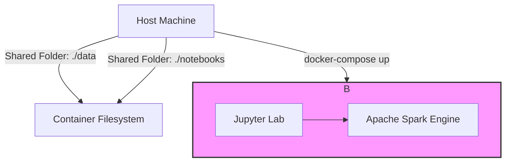

# Project: Local Big Data Laboratory with Docker and Spark

This repository documents the creation and testing of a local Big Data environment designed to analyze Apache Spark's performance across different workloads, file formats, and resource configurations.

**Author:** [Gabriel Pacheco]
**Date:** July 2025

---

## 🎯 Objective

The primary goal was to build a self-contained, reproducible data processing environment using Docker. Within this environment, practical benchmark tests were conducted to evaluate and compare:

1.  The performance impact of different **file formats** (CSV, JSON, Parquet).
2.  The processing **scalability** in relation to data volume.
3.  Hardware resource scalability by simulating processing on a **single CPU core versus multiple cores**.

---

## 🛠️ Environment Architecture

After debugging networking and memory allocation issues in a multi-node setup, the final, stable architecture is a **single-container solution running Spark in local mode**.

* **Docker & Docker Compose:** Used to declaratively build and manage the environment.
* **Docker Image:** `jupyter/all-spark-notebook:latest`, a comprehensive image containing Jupyter Lab, a full Apache Spark installation, Pandas, and other data science libraries.
* **Spark UI:** The monitoring interface used to track running jobs.
* **Volume Mapping:** Local folders (`./data` and `./notebooks`) are mapped into the container for a persistent and seamless workflow.

### Architecture Diagram



---

## 📋 Prerequisites

* [Docker](https://www.docker.com/products/docker-desktop/)
* [Docker Compose](https://docs.docker.com/compose/install/)
* [Git](https://git-scm.com/)

---

## 🚀 How to Run the Project

1.  **Clone the repository:**
    ```bash
    git clone [https://github.com/gabriel21rp/lab-bigdata-local.git](https://github.com/gabriel21rp/lab-bigdata-local.git)
    cd lab-bigdata-local
    ```

2.  **Add data files:** Place your datasets in the `/data` folder. *(Note: This folder is specified in `.gitignore` and will not be committed to the repository).*

3.  **Start the environment:**
    ```bash
    docker-compose up -d
    ```

4.  **Access Services:**
    * **Jupyter Lab:** `http://localhost:8888` (password: `padrao`)
    * **Spark UI:** `http://localhost:4040` (active during Spark job execution)

---

## 🔬 Performance Tests and Results Analysis

The notebook `notebooks/testes_desempenho.ipynb` contains an automated benchmark script to test various operations. The results below are consolidated for the **Complex Aggregation** task.

### Analysis 1: Impact of File Format

This test measured the time to read and process datasets of varying sizes and formats.

**[PASTE THE RESULTS TABLE GENERATED BY YOUR NOTEBOOK HERE]**

*Example Markdown Table:*
| file | format | rows | test_type | execution_time_s |
| :--- | :--- | ---:| :--- | ---:|
| convertido_5M.csv | csv | 5000000 | Complex Aggregation | **XX.XXXX** |
| convertido_5M.json | json | 5000000 | Complex Aggregation | **YY.YYYY** |
| convertido_5M.parquet | parquet | 5000000 | Complex Aggregation | **Z.ZZZZ** |

**Analysis Conclusion:**
The results clearly demonstrate the superiority of the Parquet format. For the 5-million-row dataset, Parquet was **[Calculate and insert: XX/Z]** times faster than CSV and **[Calculate and insert: YY/Z]** times faster than JSON. This is because Parquet is a columnar format optimized for analytics. It allows Spark to read only the necessary columns and benefits from efficient compression and metadata storage, whereas text-based formats like CSV and JSON require full parsing.

### Analysis 2: CPU Scalability (Multi-core vs. Single-core)

A second benchmark compared the execution in `local[*]` mode (all available cores) versus `local[1]` mode (a single core) for the `convertido_5000000.parquet` file.

**[PASTE THE TIME COMPARISON HERE]**

*Example:*
| Mode | Execution Time (s) |
| :--- | ---:|
| `local[*]` (Multi-core) | **A.AAAA**
