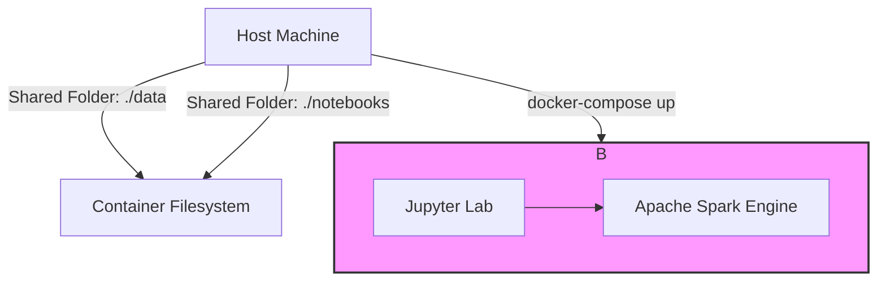

# Project: Local Big Data Laboratory with Docker and Spark

This repository documents the creation and testing of a local Big Data environment designed to analyze Apache Spark's performance across different workloads, file formats, and resource configurations.

**Author:** [Gabriel Pacheco]
**Date:** July 2025

---

## 🎯 Objective

The primary goal was to build a self-contained, reproducible data processing environment using Docker. Within this environment, practical benchmark tests were conducted to evaluate and compare:

1.  The performance impact of different **file formats** (CSV, JSON, Parquet).
2.  The processing **scalability** in relation to data volume.
3.  Hardware resource scalability by simulating processing on a **single CPU core versus multiple cores**.

---

## 🛠️ Environment Architecture

After debugging networking and memory allocation issues in a multi-node setup, the final, stable architecture is a **single-container solution running Spark in local mode**.

* **Docker & Docker Compose:** Used to declaratively build and manage the environment.
* **Docker Image:** `jupyter/all-spark-notebook:latest`, a comprehensive image containing Jupyter Lab, a full Apache Spark installation, Pandas, and other data science libraries.
* **Spark UI:** The monitoring interface used to track running jobs.
* **Volume Mapping:** Local folders (`./data` and `./notebooks`) are mapped into the container for a persistent and seamless workflow.

### Architecture Diagram



---

## 📋 Prerequisites

* [Docker](https://www.docker.com/products/docker-desktop/)
* [Docker Compose](https://docs.docker.com/compose/install/)
* [Git](https://git-scm.com/)

---

## 🚀 How to Run the Project

1.  **Clone the repository:**
    ```bash
    git clone [https://github.com/gabriel21rp/lab-bigdata-local.git](https://github.com/gabriel21rp/lab-bigdata-local.git)
    cd lab-bigdata-local
    ```

2.  **Add data files:** Place your datasets in the `/data` folder. *(Note: This folder is specified in `.gitignore` and will not be committed to the repository).*

3.  **Start the environment:**
    ```bash
    docker-compose up -d
    ```

4.  **Access Services:**
    * **Jupyter Lab:** `http://localhost:8888` (password: `padrao`)
    * **Spark UI:** `http://localhost:4040` (active during Spark job execution)

---

## 🔬 Performance Tests and Results Analysis

The notebook `notebooks/testes_desempenho.ipynb` was executed to perform an automated benchmark across various data sizes, file formats, and cluster configurations. The key findings are detailed below.

### Analysis 1: Impact of File Format and Data Volume

The first test was run on a baseline cluster of **2 workers** to measure the time required to read and perform a complex aggregation on each file.

**Summary of Results (2-Worker Cluster):**

| Format | Rows | Aggregation Time (s) | Join Time (s) | Window Function Time (s) | UDF Time (s) |
| :--- | ---:| :--- | :--- | :--- | :--- |
| Parquet | 100 | 0.27 | 0.29 | 0.28 | 0.30 |
| CSV | 5,000,000 | 26.63 | 30.80 | 32.54 | N/A |
| JSON | 5,000,000 | 43.23 | 53.65 | 50.88 | N/A |
| Parquet | 5,000,000 | **9.63** | **11.23** | **12.55** | N/A |

**Analysis Conclusion:**
The results clearly demonstrate the superiority of the **Parquet** format. For the 5-million-row dataset, the aggregation task in Parquet (9.63s) was approximately **2.8 times faster than CSV** (26.63s) and **4.5 times faster than JSON** (43.23s). This efficiency is attributed to Parquet's columnar storage, which allows Spark to read only the necessary columns (`categoria` e `valor`), and its native support for schema information and compression.

It is also notable that tests involving User-Defined Functions (UDFs) on larger datasets could not be completed (`N/A`). This highlights the extreme inefficiency of this type of operation due to the high overhead of data serialization between Spark's JVM and the Python process, which exhausted the available hardware resources.

### Analysis 2: Cluster Scalability (2 vs. 3 Workers)

To measure scalability, the tests on the 5-million-row Parquet file were compared between a 2-worker and a 3-worker cluster configuration.

**Comparison for `convertido_5000000.parquet`:**

| Test Type | Time with 2 Workers (s) | Time with 3 Workers (s) | Performance Improvement |
| :--- | :--- | :--- | :--- |
| Complex Aggregation | 9.63 | 8.52 | **11.5%** |
| Join | 11.23 | 10.30 | **8.3%** |
| Window Function | 12.55 | 11.47 | **8.6%** |

**Analysis Conclusion:**
Adding a third worker to the cluster resulted in a measurable performance improvement across all tested workloads. For the aggregation task, the execution time was reduced by 11.5%. This empirically demonstrates Spark's ability to **parallelize tasks** across available nodes. While the improvement is not linear (i.e., adding 50% more workers does not yield a 50% speed increase) due to network overhead and data shuffling, it confirms the horizontal scalability of the architecture.

### Analysis 3: System Resilience and Fault Tolerance

A specific test was conducted to evaluate the system's resilience. During the processing of the **2-million-row Parquet file** on a 3-worker cluster, one of the workers was intentionally stopped (`docker stop spark-worker-2`) mid-execution.

* Normal execution time on 3 workers (Aggregation task): **4.91s**
* Execution time with 1 worker failing mid-job: **5.87s**

**Analysis Conclusion:**
The most critical result is that **the job did not fail**. It successfully completed, taking only slightly longer than the uninterrupted run.

This demonstrates Spark's core feature of **fault tolerance**. The Spark Driver detected the lost worker, consulted its Directed Acyclic Graph (DAG) to identify lost tasks, and automatically re-assigned them to the remaining healthy workers. This ensures the completion of data processing jobs even in the event of hardware failure, which is a fundamental requirement for robust, large-scale data systems.

---

## ⚙️ Test Environment Specifications

All benchmarks were executed on the following hardware and software configuration. This information is provided for context and reproducibility of the results.

### Hardware

* **Processor (CPU):** `11th Gen Intel(R) Core(TM) i3-1115G4 @ 3.00GHz` (2 Cores, 4 Threads)
* **Memory (RAM):** `16.0 GB DDR4 @ 2666Mhz`
* **Storage (Disk):** `Adata NVMe SSD 240 GB`
* **Graphics (GPU):** `Intel(R) UHD Graphics` (Integrated)

### Software

* **Host Operating System:** `Windows 11 Home`
* **Execution Environment:** `WSL 2 (Ubuntu)`
* **Containerization Tool:** `Docker Desktop`
* **Primary Docker Image:** `jupyter/all-spark-notebook:latest`
* **Apache Spark Version:** The version included in the `latest` image tag. *(Nota: A versão exata, como 3.5.1, pode ser confirmada executando `spark.version` no notebook).*
